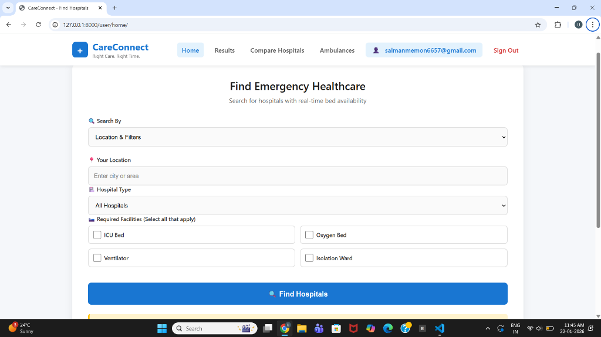
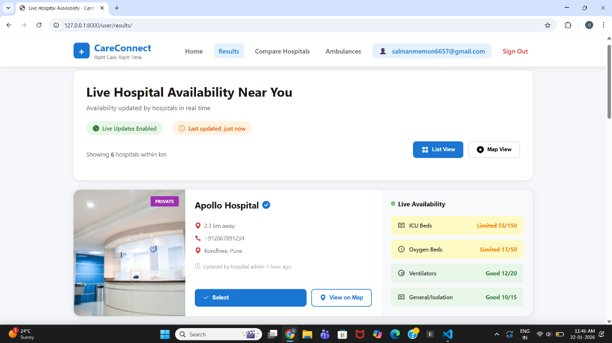
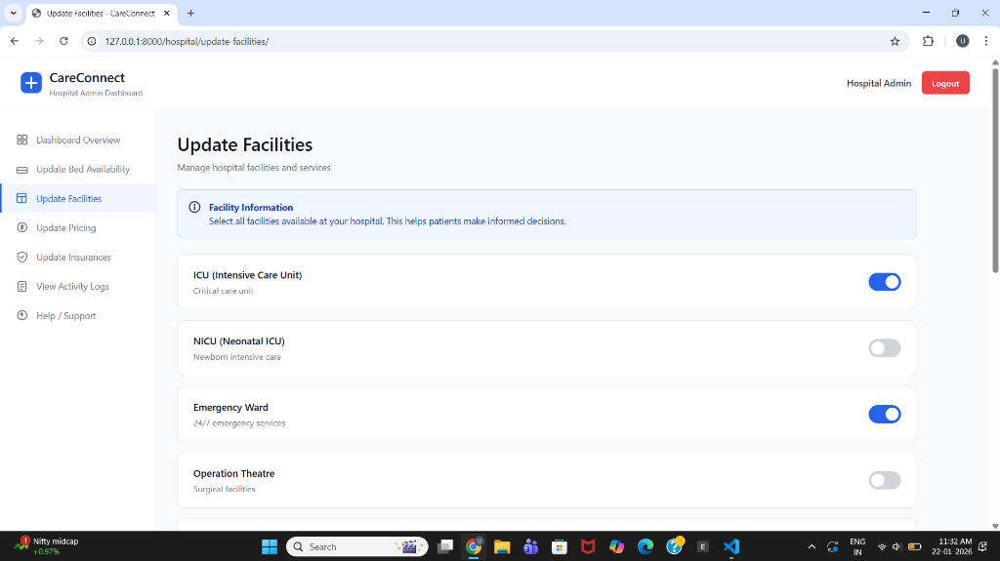
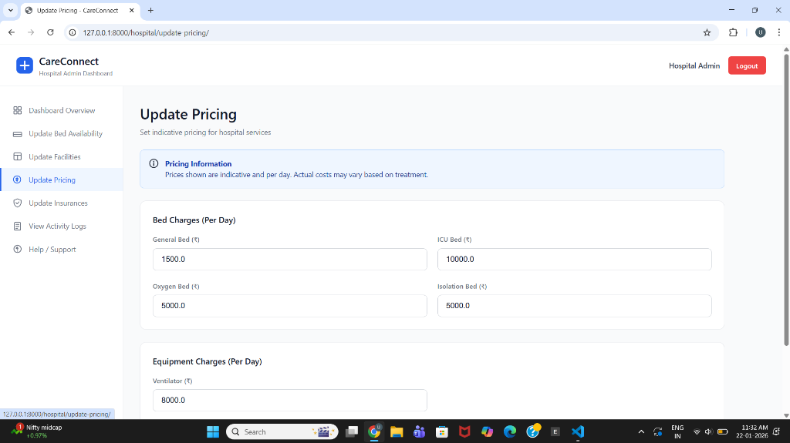
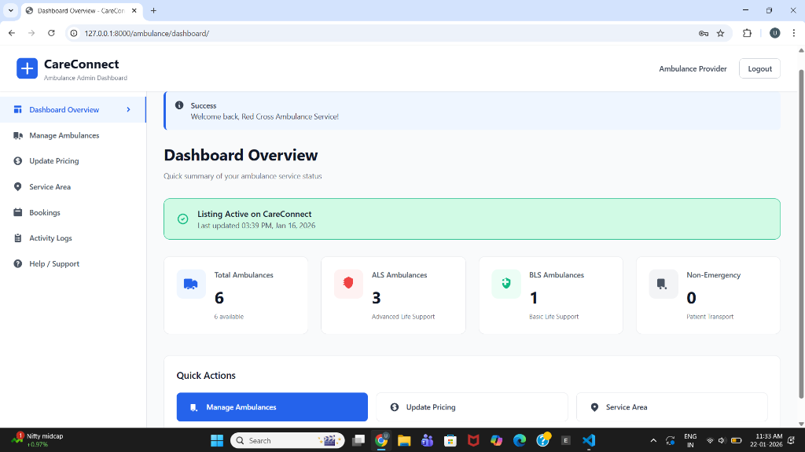
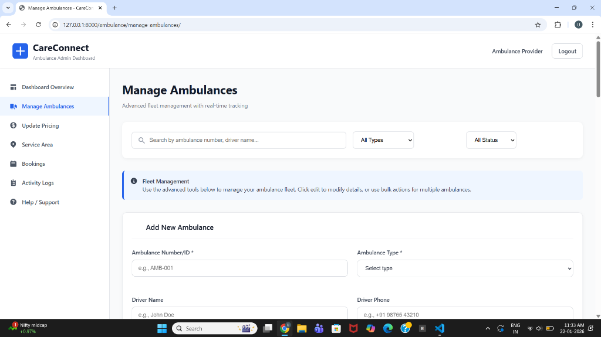

# CareConnect - Healthcare Coordination Platform

<div align="center">

**A web-based healthcare coordination platform that empowers patients and families to make informed decisions about hospital selection and ambulance services during medical emergencies.**

[](https://www.djangoproject.com/)
[](https://www.sqlite.org/)
[](#license)

</div>

---

## 🌟 Overview

CareConnect bridges the gap between patients and healthcare providers by providing real-time information about hospital bed availability, facilities, pricing, and ambulance services, enabling quick and informed decisions during medical emergencies.

## ✨ Key Features

- 🏥 **Hospital Search & Comparison** - Find and compare hospitals based on location, facilities, and real-time bed availability
- 🚑 **Ambulance Directory** - Browse ambulance services with transparent pricing and service areas
- 📊 **Admin Dashboards** - Separate dashboards for hospital and ambulance administrators
- 💰 **Transparent Pricing** - View detailed pricing for hospital services and ambulance rates
- 🛏️ **Real-time Updates** - Live bed availability and facility information

## 📸 Screenshots

### Landing Page, Sign-In and Sign-Up

````carousel

<!-- slide -->

<!-- slide -->

````

### User Dashboard

````carousel

<!-- slide -->

<!-- slide -->

<!-- slide -->

````

### Hospital Dashboard

````carousel

<!-- slide -->

<!-- slide -->

<!-- slide -->

````

### Ambulance Dashboard

````carousel

<!-- slide -->

<!-- slide -->

<!-- slide -->

<!-- slide -->

````

## 🛠️ Technology Stack

- **Frontend**: HTML5, CSS3, JavaScript
- **Backend**: Django 4.2.7, Python 3.x
- **Database**: SQLite3
- **Authentication**: Custom role-based authentication

## 🚀 Getting Started

### Prerequisites

- Python 3.8+
- pip (Python package installer)

### Installation

1. **Clone the repository**
   ```bash
   git clone <repository-url>
   cd careconnect
   ```

2. **Create and activate virtual environment**
   ```bash
   python -m venv venv
   venv\Scripts\activate  # Windows
   source venv/bin/activate  # macOS/Linux
   ```

3. **Install dependencies**
   ```bash
   pip install -r requirements.txt
   ```

4. **Configure environment variables** (if needed)
   ```bash
   cp .env.example .env
   # Edit .env with your configuration
   ```

5. **Run migrations**
   ```bash
   python manage.py migrate
   ```

6. **Start the development server**
   ```bash
   python manage.py runserver
   ```

7. **Access the application**
   - Open browser: http://localhost:8000

## 👥 User Roles

1. **General Users** - Search hospitals, compare facilities, and find ambulance services
2. **Hospital Admins** - Manage bed availability, facilities, pricing, and insurance providers
3. **Ambulance Providers** - Manage fleet, service areas, and pricing

## 📁 Project Structure

```
careconnect/
├── manage.py
├── careconnect/          # Project settings
├── core/                 # Authentication & landing pages
├── hospital/             # Hospital admin functionality
├── ambulance/            # Ambulance admin functionality
├── userapp/              # User-facing features
└── static/               # CSS, JS, images
```

## 📄 License

This project is developed for **educational purposes**.

---

<div align="center">

**Made with ❤️ for better healthcare coordination**

</div>
